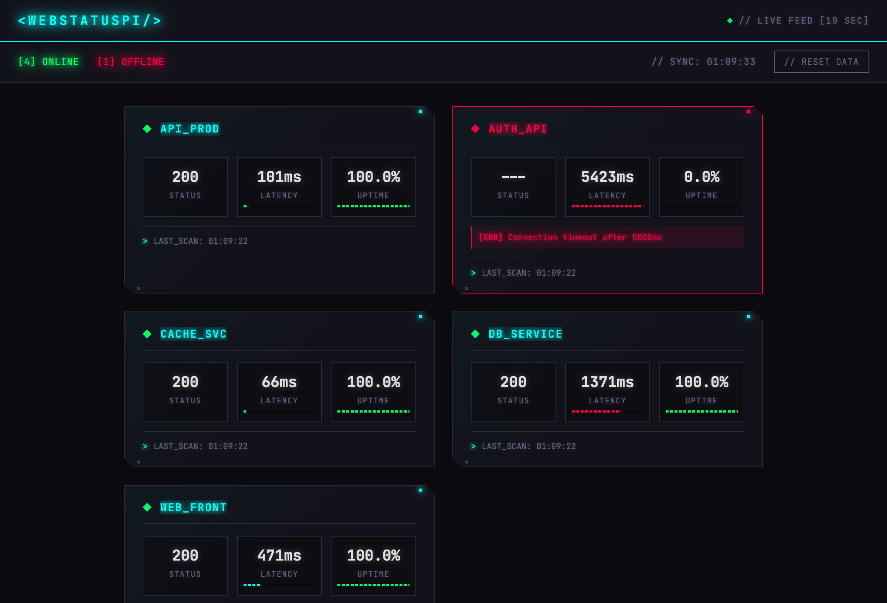
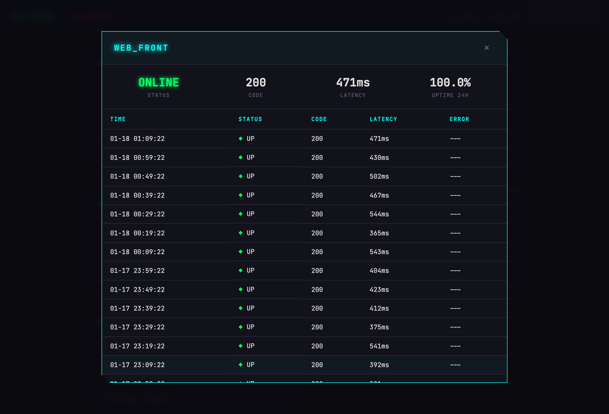

<p align="center">
  
  
  
</p>

<p align="center">
  <a href="https://github.com/jmlweb/webstatuspi/actions/workflows/test.yml"></a>
  <a href="https://github.com/jmlweb/webstatuspi/actions/workflows/lint.yml"></a>
  <a href="https://status.jmlweb.es"></a>
</p>

<h1 align="center">🖥️ WebStatusπ</h1>

<p align="center">
  <strong>Ultra-lightweight web monitoring for Raspberry Pi</strong><br>
  <em>Track uptime, response times, and get instant alerts — all from a $35 computer</em>
</p>

<p align="center">
  
</p>

---

## ✨ Why WebStatusπ?

| Feature | Benefit |
|---------|---------|
| **🪶 Ultra-lightweight** | Runs on Raspberry Pi 1B+ (512MB RAM) |
| **📊 Real-time Dashboard** | CRT-style cyberpunk interface |
| **🔌 JSON API** | Integrate with anything |
| **💾 Persistent Storage** | SQLite keeps your history safe |
| **⚡ Zero Config** | Works out of the box |

### Resource Comparison

How does WebStatusπ compare to popular alternatives?

**Docker Benchmark** (5 URLs, 60s interval, 10 samples)

| Tool | RAM Usage | CPU Usage | Docker Image |
|------|-----------|-----------|--------------|
| **WebStatusπ** | **17 MB** | 0.2% | 61 MB |
| Statping-ng | 30 MB | 0.5% | 58 MB |
| Uptime Kuma | 114 MB | 0.2% | 439 MB |

**Real-world on Raspberry Pi 1B+** (ARMv6, 512MB RAM)

| Metric | Value |
|--------|-------|
| RAM (application) | ~20 MB |
| RAM (with Python runtime) | ~34 MB |
| CPU | 1-2% idle, peaks during checks |
| Storage | <1 MB (uses system Python) |

**Installation Size** (native, no Docker)

| Tool | Install Size | Requires |
|------|--------------|----------|
| **WebStatusπ** | **<1 MB** | System Python 3.7+ |
| Statping-ng | ~58 MB | Go binary |
| Uptime Kuma | ~150 MB | Node.js runtime |

*Run `./benchmark/benchmark.sh` to reproduce the Docker benchmark.*

---

## 🚀 Quick Start

### One-Line Install (Recommended)

Run this on your Raspberry Pi:

```bash
curl -sSL https://raw.githubusercontent.com/jmlweb/webstatuspi/main/install.sh | bash
```

The interactive installer will:
- Install dependencies and create a virtual environment
- Guide you through URL configuration
- Optionally set up auto-start on boot

**That's it!** Open `http://<your-pi-ip>:8080` in your browser.

<details>
<summary>📦 Manual Installation</summary>

```bash
# Clone and install
git clone https://github.com/jmlweb/webstatuspi.git
cd webstatuspi
python3 -m venv venv
source venv/bin/activate
pip install .

# Configure
cp config.example.yaml config.yaml
# Edit config.yaml with your URLs

# Run
webstatuspi
```

</details>

<details>
<summary>⚙️ Installer Options</summary>

```bash
# Interactive installation
./install.sh

# Non-interactive with defaults
./install.sh --non-interactive

# System-wide installation (with systemd service)
sudo ./install.sh --install-dir /opt/webstatuspi

# Update existing installation
./install.sh --update

# Uninstall
./install.sh --uninstall
```

</details>

---

## 📺 Dashboard

<table>
<tr>
<td width="50%">

### Overview


Real-time status cards with latency and 24h uptime metrics.

</td>
<td width="50%">

### Detail View


Click any card to see full check history with timestamps.

</td>
</tr>
</table>

**Features:**
- 🔄 Auto-refresh every 10 seconds
- 🟢🔴 Color-coded status indicators
- 📈 Response time graphs
- 🕹️ Retro CRT aesthetic with scanlines
- 📱 **PWA Support** - Install as app on mobile/desktop

### 📱 Install as App (PWA)

The dashboard is a Progressive Web App that can be installed on your device for quick access:

**Desktop (Chrome/Edge):**
1. Open the dashboard in your browser
2. Click the install icon (⊕) in the address bar
3. Click "Install"

**Mobile (Android):**
1. Open the dashboard in Chrome
2. Tap the menu (⋮) → "Add to Home Screen"
3. Tap "Install"

**Mobile (iOS):**
1. Open the dashboard in Safari
2. Tap the share button (↑)
3. Tap "Add to Home Screen"

**PWA Features:**
- Works offline (shows cached data when network unavailable)
- App-like experience (no browser UI)
- Automatic updates when new versions are deployed
- Fast loading via Service Worker caching

> **Note:** For production deployments, HTTPS is required for PWA features to work. On `localhost`, PWA works without HTTPS for development.

---

## 🔧 API Reference

### Endpoints

| Method | Endpoint | Description |
|--------|----------|-------------|
| `GET` | `/` | Web dashboard |
| `GET` | `/status` | All URLs status with 24h statistics |
| `GET` | `/status/{name}` | Specific URL status |
| `GET` | `/history/{name}` | Check history (last 24h, max 100 records) |
| `GET` | `/health` | Health check |
| `GET` | `/metrics` | Prometheus metrics |
| `GET` | `/badge.svg` | Status badge (SVG image) |
| `DELETE` | `/reset` | Reset all data (token auth if configured) |

### Example Response

```bash
curl http://localhost:8080/status
```

```json
{
  "urls": [
    {
      "name": "MY_SITE",
      "url": "https://example.com",
      "is_up": true,
      "status_code": 200,
      "response_time_ms": 150,
      "error": null,
      "last_check": "2026-01-23T10:30:00Z",
      "checks_24h": 1440,
      "uptime_24h": 99.5,
      "avg_response_time_24h": 145.2,
      "min_response_time_24h": 120,
      "max_response_time_24h": 200,
      "p50_response_time_24h": 142,
      "p95_response_time_24h": 185,
      "p99_response_time_24h": 198,
      "stddev_response_time_24h": 15.3,
      "consecutive_failures": 0,
      "ssl_cert_expires_in_days": 365
    }
  ],
  "summary": {
    "total": 1,
    "up": 1,
    "down": 0
  }
}
```

### Delete/Reset Endpoint

Reset all monitoring data (useful for testing or fresh start):

```bash
# Without token (if api.reset_token not configured)
curl -X DELETE http://localhost:8080/reset

# With token authentication
curl -X DELETE http://localhost:8080/reset \
  -H "Authorization: Bearer your-secret-token"
```

**Security notes:**
- Blocked if accessed through Cloudflare (external access)
- Requires Bearer token if `api.reset_token` is set in config

### Status Badge

Embed a shields.io-style status badge in your README or website:

```markdown
<!-- Overall system status -->


<!-- Specific service status -->

```

**Badge colors:**

| State | Color | Meaning |
|-------|-------|---------|
| UP | Green | All services operational (or specific service is up) |
| DOWN | Red | All services down (or specific service is down) |
| DEGRADED | Yellow | Some services up, some down |
| UNKNOWN | Gray | No monitoring data available |

**Headers:**
- `Content-Type: image/svg+xml`
- `Cache-Control: public, max-age=60` (CDN-friendly)

---

## 📊 Prometheus Integration

WebStatusπ exposes metrics in Prometheus text format, allowing you to integrate with your existing monitoring stack and create custom Grafana dashboards.

### Metrics Endpoint

**GET** `/metrics`

Returns metrics in Prometheus exposition format:

```bash
curl http://localhost:8080/metrics
```

**Example output:**

```prometheus
# HELP webstatuspi_uptime_percentage Uptime percentage for the last 24 hours
# TYPE webstatuspi_uptime_percentage gauge
webstatuspi_uptime_percentage{url_name="MY_SITE",url="https://example.com"} 99.5

# HELP webstatuspi_response_time_ms Response time metrics in milliseconds
# TYPE webstatuspi_response_time_ms gauge
webstatuspi_response_time_ms{url_name="MY_SITE",url="https://example.com",type="avg"} 150.0
webstatuspi_response_time_ms{url_name="MY_SITE",url="https://example.com",type="min"} 120
webstatuspi_response_time_ms{url_name="MY_SITE",url="https://example.com",type="max"} 200

# HELP webstatuspi_checks_total Total number of checks performed
# TYPE webstatuspi_checks_total counter
webstatuspi_checks_total{url_name="MY_SITE",url="https://example.com",status="success"} 143
webstatuspi_checks_total{url_name="MY_SITE",url="https://example.com",status="failure"} 1

# HELP webstatuspi_last_check_timestamp Unix timestamp of last check
# TYPE webstatuspi_last_check_timestamp gauge
webstatuspi_last_check_timestamp{url_name="MY_SITE",url="https://example.com"} 1737544800
```

### Available Metrics

| Metric | Type | Description | Labels |
|--------|------|-------------|--------|
| `webstatuspi_uptime_percentage` | gauge | Uptime percentage for the last 24 hours (0-100) | `url_name`, `url` |
| `webstatuspi_response_time_ms` | gauge | Response time in milliseconds | `url_name`, `url`, `type` (avg/min/max) |
| `webstatuspi_checks_total` | counter | Total number of checks performed | `url_name`, `url`, `status` (success/failure) |
| `webstatuspi_last_check_timestamp` | gauge | Unix timestamp of last check | `url_name`, `url` |

### Prometheus Configuration

Add this scrape config to your `prometheus.yml`:

```yaml
scrape_configs:
  - job_name: 'webstatuspi'
    static_configs:
      - targets: ['<raspberry-pi-ip>:8080']
    metrics_path: /metrics
    scrape_interval: 30s
```

### Example PromQL Queries

**Average uptime across all URLs:**
```promql
avg(webstatuspi_uptime_percentage)
```

**URLs with uptime below 99%:**
```promql
webstatuspi_uptime_percentage < 99
```

**Average response time per URL:**
```promql
webstatuspi_response_time_ms{type="avg"}
```

**Total failures in last hour:**
```promql
increase(webstatuspi_checks_total{status="failure"}[1h])
```

**URLs not checked in last 5 minutes:**
```promql
(time() - webstatuspi_last_check_timestamp) > 300
```

### Grafana Dashboard

Create custom Grafana dashboards using these metrics:

**Example panels:**

1. **Uptime Overview** (Gauge panel)
   - Query: `avg(webstatuspi_uptime_percentage)`
   - Thresholds: Red (<95%), Yellow (95-99%), Green (>99%)

2. **Response Time by URL** (Graph panel)
   - Query: `webstatuspi_response_time_ms{type="avg"}`
   - Legend: `{{url_name}}`

3. **Success Rate** (Stat panel)
   - Query: `sum(webstatuspi_checks_total{status="success"}) / sum(webstatuspi_checks_total) * 100`

4. **Failed Checks (Last Hour)** (Stat panel)
   - Query: `increase(webstatuspi_checks_total{status="failure"}[1h])`

5. **Check Status Table** (Table panel)
   - Queries:
     - `webstatuspi_uptime_percentage` (Uptime %)
     - `webstatuspi_response_time_ms{type="avg"}` (Avg Response Time)
     - `time() - webstatuspi_last_check_timestamp` (Last Check)

### Integration Notes

- **Scraping frequency**: Recommended 30-60 seconds to match typical check intervals
- **Cardinality**: Low - one metric series per URL (typically 5-20 URLs)
- **Performance**: Zero overhead - metrics are computed from existing database queries
- **History**: Metrics reflect 24-hour aggregates from SQLite database

---

## 🔔 Webhook Alerts

Get instant notifications when URLs go down or recover. Integrate with Slack, Discord, PagerDuty, or any custom webhook endpoint.

### Setup Webhooks

Add to your `config.yaml`:

```yaml
alerts:
  webhooks:
    - url: "https://hooks.slack.com/services/YOUR/SLACK/WEBHOOK"
      enabled: true
      on_failure: true      # Alert when URL goes DOWN
      on_recovery: true     # Alert when URL comes back UP
      cooldown_seconds: 300 # Minimum time between alerts (prevents spam)
```

### Supported Services

| Service | Webhook Type | Notes |
|---------|--------------|-------|
| **Slack** | Incoming Webhook | Configure in Apps & integrations |
| **Discord** | Webhook URL | Copy webhook URL from channel settings |
| **Telegram** | Bot API | [Setup guide](docs/TELEGRAM_SETUP.md) - requires relay service |
| **PagerDuty** | Events API v2 | Sends to incidents/events endpoint |
| **Custom HTTP** | Any endpoint | Receives JSON payload |

### Webhook Payload

Every alert sends this JSON structure:

```json
{
  "event": "url_down",
  "url": {
    "name": "API_SERVER",
    "url": "https://api.example.com"
  },
  "status": {
    "code": 503,
    "success": false,
    "response_time_ms": 5000,
    "error": "Service Unavailable",
    "timestamp": "2026-01-21T10:30:00Z"
  },
  "previous_status": "up"
}
```

### Latency Degradation Alerts

Monitor response times and get alerted when services become slow, even if they're still responding successfully. This helps detect performance degradation before it causes a complete outage.

#### Setup Latency Monitoring

Add latency thresholds to any URL in your configuration:

```yaml
urls:
  - name: "CRITICAL_API"
    url: "https://api.example.com/health"
    latency_threshold_ms: 2000        # Alert if response time exceeds 2000ms
    latency_consecutive_checks: 3     # Must exceed threshold 3 times in a row (default: 3)

  - name: "PAYMENT_API"
    url: "https://payments.example.com"
    latency_threshold_ms: 1000         # Alert if response time exceeds 1000ms
    latency_consecutive_checks: 5      # Require 5 consecutive slow checks before alerting
```

#### How It Works

1. **Threshold Detection**: After each check, if the response time exceeds `latency_threshold_ms`, a counter increments.
2. **Alert Trigger**: When the counter reaches `latency_consecutive_checks`, a `latency_high` alert is sent.
3. **Recovery**: When latency returns below the threshold, a `latency_normal` alert is sent and the counter resets.

This prevents false positives from temporary network spikes while catching sustained performance issues.

#### Latency Alert Payload

Latency alerts use the same webhook infrastructure as up/down alerts, but with a different event type:

```json
{
  "event": "latency_high",
  "url": {
    "name": "CRITICAL_API",
    "url": "https://api.example.com/health"
  },
  "latency": {
    "current_ms": 2500,
    "threshold_ms": 2000,
    "consecutive_checks": 3
  },
  "timestamp": "2026-01-23T10:30:00Z"
}
```

**Event Types:**
- `latency_high`: Triggered when latency exceeds threshold for configured consecutive checks
- `latency_normal`: Triggered when latency returns below threshold after an active alert

**Note**: Latency alerts respect the same `cooldown_seconds` setting as up/down alerts to prevent spam.

### Configuration Options

```yaml
alerts:
  webhooks:
    - url: "https://example.com/webhook"

      # Whether this webhook is active (default: true)
      enabled: true

      # Send alert when URL transitions from UP → DOWN (default: true)
      on_failure: true

      # Send alert when URL transitions from DOWN → UP (default: true)
      on_recovery: true

      # Minimum seconds between alerts for the same URL (default: 300)
      # Prevents alert spam if a service is flaky
      cooldown_seconds: 300
```

### Test Your Webhooks

Verify webhook configuration before deployment:

```bash
webstatuspi test-alert
```

Output:
```
Testing 2 webhook(s)...

✓ SUCCESS: https://hooks.slack.com/services/YOUR/SLACK/WEBHOOK
✗ FAILED: https://example.com/broken-webhook

Result: 1/2 webhooks successful
```

### Advanced: Webhook Security

For sensitive webhooks, use these patterns:

**Option 1: Authentication Headers**
Configure your webhook endpoint to require an auth token, then test with curl:

```bash
curl -X POST https://example.com/webhook \
  -H "Authorization: Bearer YOUR_TOKEN" \
  -H "Content-Type: application/json" \
  -d '{"event":"test"}'
```

**Option 2: HMAC Signature (Future)**
WebStatusπ may support HMAC-SHA256 signatures in future versions.

### Example: Slack Integration

1. Create Slack Incoming Webhook: https://api.slack.com/apps → Your App → Incoming Webhooks
2. Copy webhook URL
3. Add to `config.yaml`:

```yaml
alerts:
  webhooks:
    - url: "https://hooks.slack.com/services/T00000000/B00000000/XXXXXXXXXXXX"
      enabled: true
      on_failure: true
      on_recovery: true
      cooldown_seconds: 300
```

4. Test: `webstatuspi test-alert`
5. Your Slack channel will receive alerts when services go down

### Example: Discord Integration

1. Enable Developer Mode in Discord (User Settings → Advanced)
2. Right-click channel → Edit Channel → Webhooks → Create Webhook
3. Copy webhook URL
4. Add to `config.yaml`:

```yaml
alerts:
  webhooks:
    - url: "https://discord.com/api/webhooks/123456789/abcdefg"
      enabled: true
      on_failure: true
      on_recovery: false  # Only alert on failures
      cooldown_seconds: 600
```

---

## 🔄 Auto-Start on Boot

Install as a systemd service:

```bash
# Preview what will be installed
webstatuspi install-service --dry-run

# Install and start
sudo webstatuspi install-service --enable --start
```

<details>
<summary>📋 Service management commands</summary>

```bash
sudo systemctl status webstatuspi   # Check status
sudo journalctl -u webstatuspi -f   # View live logs
sudo systemctl restart webstatuspi  # Restart
sudo systemctl stop webstatuspi     # Stop
```

</details>

---

## ⚙️ Configuration

### Full Example

```yaml
monitor:
  interval: 60              # seconds between checks

urls:
  - name: "PROD_API"        # max 10 characters
    url: "https://api.example.com"
    timeout: 10

  - name: "STAGING"
    url: "https://staging.example.com"
    timeout: 5

server:
  port: 8080
  host: 0.0.0.0             # listen on all interfaces

database:
  path: "./data/monitoring.db"
  retention_days: 7         # auto-cleanup old data
```

### Content Validation

Monitor not just HTTP status codes, but also response content. This helps detect when services return error pages with 200 status codes.

**Keyword Validation** - Check if response body contains a specific string:

```yaml
urls:
  - name: "API_PROD"
    url: "https://api.example.com/health"
    timeout: 10
    keyword: "OK"  # Case-sensitive substring check
```

**JSON Path Validation** - Check if JSON response has expected value at path:

```yaml
urls:
  - name: "API_STG"
    url: "https://staging.example.com/api/status"
    timeout: 10
    json_path: "status.healthy"  # Checks if response.status.healthy is truthy
```

**How it works:**

- Validation only runs if HTTP status is 2xx or 3xx
- If validation fails, URL is marked as DOWN with error message
- Response body limited to 1MB for memory efficiency (Pi 1B+)
- Keyword check: case-sensitive substring match
- JSON path: supports dot-notation (e.g., `"data.user.active"`)
- JSON values must be truthy (true, "ok", 1, etc.)

**Use cases:**

| Scenario | Solution |
|----------|----------|
| API returns error page with 200 status | Use `keyword` to check for success message |
| Health endpoint returns JSON status | Use `json_path` to check specific field |
| CDN returns cached error page | Use `keyword` to verify expected content |
| Backend returns maintenance page | Use `keyword` to detect unexpected content |

### Custom Success Codes

By default, HTTP status codes 200-399 are treated as success. You can customize this per URL using `success_codes`:

```yaml
urls:
  # Accept specific codes (e.g., API that returns 201 on create)
  - name: "API_CREATE"
    url: "https://api.example.com/create"
    timeout: 10
    success_codes: [200, 201, 202]

  # Accept code ranges (e.g., legacy API where 400 means "no results")
  - name: "API_LEGACY"
    url: "https://legacy.example.com/api"
    timeout: 10
    success_codes: ["200-299", 400]
```

**Supported formats:**

| Format | Example | Meaning |
|--------|---------|---------|
| Single code | `200` | Exactly status code 200 |
| Multiple codes | `[200, 201, 202]` | Any of 200, 201, or 202 |
| Range | `"200-299"` | 200 to 299 inclusive |
| Mixed | `["200-299", 400]` | 2xx range plus 400 |

**Notes:**
- If `success_codes` is not specified, default range 200-399 is used
- Status codes must be valid HTTP codes (100-599)
- Ranges use string format with hyphen: `"200-299"`

### TCP Port Monitoring

Monitor non-HTTP services like databases, caches, and custom services by checking TCP port connectivity:

```yaml
tcp:
  # Database connectivity check
  - name: "DB_PROD"
    host: "db.example.com"
    port: 5432
    timeout: 5

  # Redis cache check
  - name: "REDIS"
    host: "redis.example.com"
    port: 6379
    timeout: 3
```

**How it works:**

| Condition | Result |
|-----------|--------|
| TCP connection succeeds | Target marked UP |
| Connection refused | Target marked DOWN |
| Connection timeout | Target marked DOWN with timeout message |

**Notes:**
- TCP checks measure connection establishment time (response_time_ms)
- No HTTP protocol overhead - faster than HTTP checks
- Status code is `null` for TCP checks (no HTTP status)
- URL format in API: `tcp://host:port`

### DNS Resolution Monitoring

Monitor DNS resolution for domain names to detect DNS propagation issues, server failures, or misconfigured records:

```yaml
dns:
  # Basic DNS resolution check
  - name: "DNS_MAIN"
    host: "example.com"
    record_type: A  # A (IPv4) or AAAA (IPv6)
    timeout: 5

  # Verify resolved IP matches expected value
  - name: "DNS_API"
    host: "api.example.com"
    record_type: A
    expected_ip: "192.0.2.1"
```

**How it works:**

| Condition | Result |
|-----------|--------|
| DNS resolution succeeds | Target marked UP |
| Resolution fails | Target marked DOWN with error |
| Resolved IP doesn't match expected | Target marked DOWN with mismatch message |

**Supported record types:**

| Type | Description |
|------|-------------|
| `A` | IPv4 address resolution (default) |
| `AAAA` | IPv6 address resolution |

**Notes:**
- DNS checks measure resolution time (response_time_ms)
- Uses OS DNS resolver (no additional dependencies)
- URL format in API: `dns://hostname`

### SSL Certificate Monitoring

WebStatusπ automatically monitors SSL certificates for all HTTPS URLs. No additional configuration is required.

**What's monitored:**

- Certificate expiration date
- Days until expiration (negative if expired)
- Certificate issuer (e.g., "Let's Encrypt")
- Certificate subject (common name)

**Behavior:**

| Condition | Result |
|-----------|--------|
| Certificate valid | Normal monitoring, SSL info in API response |
| Certificate expires within threshold | Warning logged, URL still marked UP |
| Certificate expired | URL marked DOWN with error message |
| SSL extraction fails | URL status unaffected, error stored in `ssl_cert_error` |

**Configuration:**

```yaml
monitor:
  interval: 60
  ssl_warning_days: 30  # Days before expiration to log warnings (default: 30)
```

**API Response (SSL fields):**

```json
{
  "name": "MY_SITE",
  "ssl_cert_issuer": "Let's Encrypt",
  "ssl_cert_subject": "example.com",
  "ssl_cert_expires_at": "2025-12-31T23:59:59Z",
  "ssl_cert_expires_in_days": 365,
  "ssl_cert_error": null
}
```

**Prometheus metric:**

```prometheus
webstatuspi_ssl_cert_expires_in_days{url_name="MY_SITE",url="https://example.com",issuer="Let's Encrypt",subject="example.com"} 365
```

### Performance Tips

For Raspberry Pi 1B+:

| Setting | Recommendation |
|---------|----------------|
| URLs | 5-10 max |
| Interval | 30+ seconds |
| Timeout | 10s or less |

### Environment Variables

Override any configuration value using environment variables with the `WEBSTATUS_` prefix:

| Variable | Config Path | Example |
|----------|-------------|---------|
| `WEBSTATUS_API_PORT` | `api.port` | `8080` |
| `WEBSTATUS_API_RESET_TOKEN` | `api.reset_token` | `secret123` |
| `WEBSTATUS_MONITOR_INTERVAL` | `monitor.interval` | `60` |
| `WEBSTATUS_DATABASE_PATH` | `database.path` | `/data/status.db` |
| `WEBSTATUS_DATABASE_RETENTION_DAYS` | `database.retention_days` | `7` |

Environment variables take precedence over `config.yaml` values.

---

## 🔒 Security Features

WebStatusπ includes several security measures:

| Feature | Description |
|---------|-------------|
| **Rate Limiting** | 60 requests/min per IP (localhost exempt) |
| **SSRF Protection** | Blocks private IPs, localhost, dangerous ports |
| **CSP Headers** | Content Security Policy with nonces |
| **Input Validation** | URL names sanitized to prevent injection |

### SSRF Protection

URLs configured for monitoring are validated to prevent Server-Side Request Forgery:
- Only `http://` and `https://` schemes allowed
- Private IP ranges blocked (10.x, 172.16.x, 192.168.x, localhost)
- Internal service ports blocked (22, 3306, 5432, 6379, etc.)

---

## 🛠️ Development

```bash
# Setup
python3 -m venv venv
source venv/bin/activate
pip install .[dev]

# Run tests
pytest tests/ -v

# Run benchmark (Docker required)
cd benchmark && ./benchmark.sh
```

### Project Structure

```
webstatuspi/
├── webstatuspi/        # Core package
│   ├── __init__.py     # CLI entry point
│   ├── alerter.py      # Webhook alerts
│   ├── api.py          # HTTP server
│   ├── config.py       # Configuration
│   ├── database.py     # SQLite operations
│   ├── models.py       # Data models
│   └── monitor.py      # URL checker
├── tests/              # Test suite
└── docs/               # Documentation
```

---

## 🔮 Roadmap

- [ ] 0.96" OLED display support
- [ ] Physical button navigation
- [ ] Buzzer alerts on failures
- [ ] Status LEDs (green/red)

---

## 🐛 Troubleshooting

<details>
<summary><strong>API not accessible from other devices</strong></summary>

1. Check firewall: `sudo ufw allow 8080`
2. Verify config has `host: 0.0.0.0`
3. Check Pi IP: `ip addr show`

</details>

<details>
<summary><strong>High CPU usage</strong></summary>

- Increase polling interval to 60+ seconds
- Reduce number of monitored URLs
- Check for slow/timing out URLs

</details>

<details>
<summary><strong>Connection timeouts</strong></summary>

- Increase `timeout` value in config
- Test network: `ping google.com`
- Test URL manually: `curl -I <url>`

</details>

See [Troubleshooting Guide](docs/TROUBLESHOOTING.md) for more.

---

## 📚 Documentation

| Document | Description |
|----------|-------------|
| [Architecture](docs/ARCHITECTURE.md) | System design & database schema |
| [Hardware](docs/HARDWARE.md) | GPIO pins & OLED setup |
| [Telegram Setup](docs/TELEGRAM_SETUP.md) | Push notifications via Telegram |
| [Contributing](CONTRIBUTING.md) | How to contribute |
| [Development Rules](AGENTS.md) | Code style & conventions |

---

## 📄 License

MIT License — see [LICENSE](LICENSE) for details.

---

<p align="center">
  <strong>Built with ❤️ for Raspberry Pi enthusiasts</strong><br>
  <em>Lightweight. Reliable. Open Source.</em>
</p>
