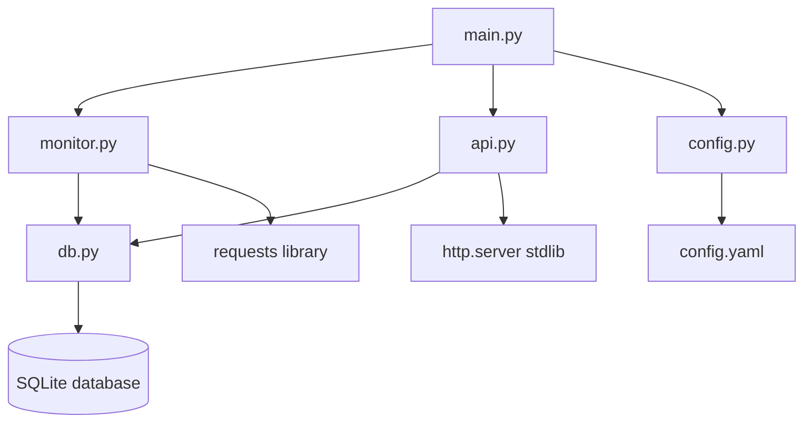
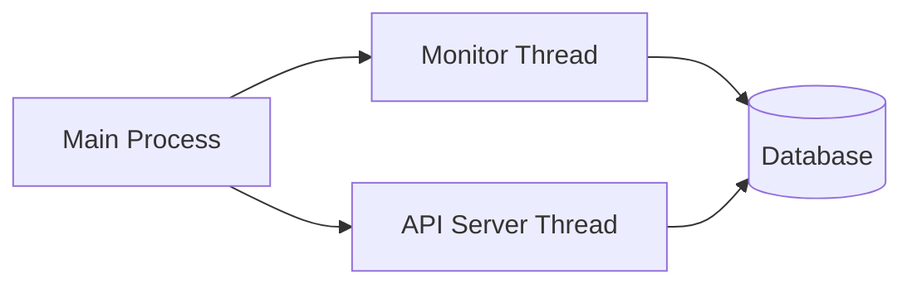
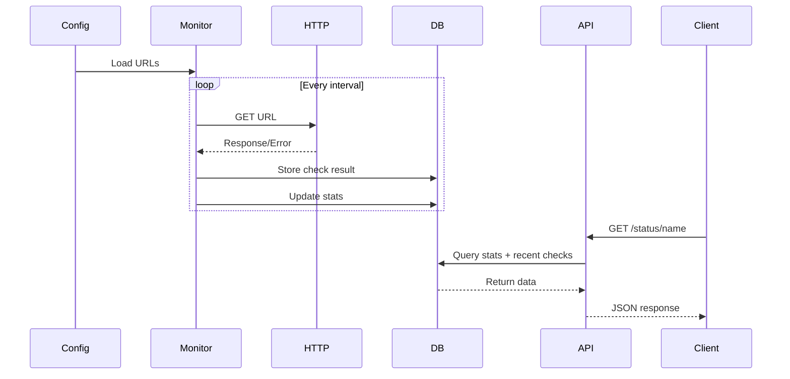

# Architecture Documentation - WebStatusPi

This document describes the system architecture, design decisions, and data flow for WebStatusPi. For hardware specifications, see [HARDWARE.md](HARDWARE.md).

## System Overview

WebStatusPi is a lightweight web monitoring system designed specifically for Raspberry Pi 1B+. It monitors configured URLs, tracks success/failure statistics, and provides a JSON API for accessing monitoring data.

**Hardware Target**: Raspberry Pi 1B+ (512MB RAM, single-core 700MHz ARM11)

### Component Diagram



## Core Components

1. **Monitor** (`monitor.py`): Main polling loop that checks URLs at configured intervals
2. **Database** (`db.py`): SQLite operations (schema initialization, queries, stats updates)
3. **Web Server** (`api.py`): Minimal HTTP server using stdlib for serving JSON statistics
4. **Config Loader** (`config.py`): YAML parsing and validation with dataclasses
5. **Main** (`main.py`): Entry point that orchestrates monitor and API server threads

## Performance Constraints (Pi 1B+ Specific)

The Raspberry Pi 1B+ has severe resource limitations that drive all architectural decisions:

- **CPU**: Single-core 700MHz ARM11 processor
- **RAM**: 512MB (shared with GPU ~256MB available for OS)
- **Network**: 10/100 Ethernet only
- **Storage**: SD card (slow I/O, wear considerations)

**Constraints**:
- Must be extremely lightweight
- Avoid heavy frameworks (no Flask, FastAPI, Django)
- Use stdlib wherever possible
- Minimize dependencies
- Avoid CPU-intensive operations
- Minimize disk writes (SD card wear)

## Thread Architecture

The system uses two main threads: one for monitoring URLs and one for serving the API.



### Thread Responsibilities

**Monitor Thread**:
- Polls URLs at configured intervals
- Stores check results in database
- Updates statistics table
- Logs results to console

**API Server Thread**:
- Listens for HTTP requests on configured port
- Queries database for statistics
- Returns JSON responses
- Handles errors gracefully

Both threads share the same SQLite database. SQLite handles concurrent access internally (readers don't block readers, writes are serialized).

## Data Flow

### Monitoring Flow



### Detailed Monitoring Flow

1. **Configuration Loading** (`main.py` → `config.py`):
   - Load and validate `config.yaml`
   - Parse server settings, monitoring settings, and URL list
   - Validate intervals, timeouts, and URL names

2. **Database Initialization** (`main.py` → `db.py`):
   - Create SQLite database file if not exists
   - Create tables: `urls`, `checks`, `stats`
   - Create indexes for efficient queries
   - Insert/update URL configurations from config file

3. **Monitoring Loop** (`monitor.py`):
   - For each configured URL:
     - Wait for configured interval
     - Make HTTP GET request with timeout
     - Record response time, status code, success/failure
     - Store result in `checks` table
     - Update aggregated stats in `stats` table
     - Log result to console

4. **API Requests** (`api.py`):
   - Accept HTTP GET requests
   - Parse URL path (`/` or `/status/{name}`)
   - Query `stats` table for aggregated data
   - Query `checks` table for recent history (if needed)
   - Format JSON response
   - Return HTTP response with JSON body

## Database Design

### Schema

```sql
-- Stores monitored URL configurations
CREATE TABLE urls (
    id INTEGER PRIMARY KEY AUTOINCREMENT,
    name TEXT NOT NULL UNIQUE,
    url TEXT NOT NULL
);

-- Stores individual check results (detailed history)
CREATE TABLE checks (
    id INTEGER PRIMARY KEY AUTOINCREMENT,
    url_id INTEGER NOT NULL,
    timestamp DATETIME DEFAULT CURRENT_TIMESTAMP,
    status_code INTEGER,
    success BOOLEAN NOT NULL,
    response_time REAL,  -- milliseconds
    error_message TEXT,
    FOREIGN KEY (url_id) REFERENCES urls(id)
);

-- Stores aggregated statistics (fast queries, no need to scan checks table)
CREATE TABLE stats (
    url_id INTEGER PRIMARY KEY,
    total_requests INTEGER DEFAULT 0,
    total_failures INTEGER DEFAULT 0,
    last_check DATETIME,
    last_status TEXT,  -- 'success' or 'failure'
    FOREIGN KEY (url_id) REFERENCES urls(id)
);
```

### Design Rationale

- **Separate `stats` table**: Avoids expensive aggregations on `checks` table for every API request
- **`checks` table can be pruned**: Historical data can be cleaned up periodically without losing summary stats
- **Indexes**: 
  - Index on `checks.url_id` for fast lookups by URL
  - Index on `checks.timestamp` for efficient time-based queries
  - Primary key on `urls.name` ensures uniqueness

### Data Retention

The `checks` table can grow indefinitely without retention limits. To prevent database size issues on the Raspberry Pi 1B+ SD card, automatic cleanup removes records older than a configured number of days.

**Default Retention: 7 days** (configurable via `database.retention_days` in `config.yaml`)

**Rationale for 7-day default:**
- **Storage calculation**: With typical usage (5-10 URLs, 30-60s intervals):
  - ~14,400 checks/day × ~100 bytes/check ≈ **1.4 MB/day**
  - 7 days ≈ **10 MB** total (manageable for SD card)
  - 30 days ≈ **42 MB** (larger but acceptable if needed)
- **Benefits**:
  - Balances useful history (weekly patterns) with storage constraints
  - Reduces SD card wear (fewer long-running queries)
  - Keeps database size manageable for Pi 1B+ hardware
  - Maintains query performance (smaller table = faster queries)
- **Implementation**: Periodic cleanup runs after each check cycle (configurable frequency)

**Note**: The `stats` table (aggregated statistics) is preserved regardless of cleanup. Only individual `checks` records are deleted.

## API Design

### Endpoints

#### `GET /`

Returns overall statistics for all monitored URLs.

**Response format**:
```json
{
  "urls": [
    {
      "name": "Google",
      "url": "https://www.google.com",
      "total_requests": 150,
      "total_failures": 2,
      "success_rate": 98.67,
      "last_check": "2026-01-16T22:30:15",
      "last_status": "success",
      "last_status_code": 200
    }
  ],
  "summary": {
    "total_urls": 1,
    "total_requests": 150,
    "total_failures": 2,
    "overall_success_rate": 98.67
  }
}
```

#### `GET /status/{name}`

Returns detailed statistics for a specific URL by name.

**Response format**:
```json
{
  "name": "Google",
  "url": "https://www.google.com",
  "total_requests": 150,
  "total_failures": 2,
  "success_rate": 98.67,
  "last_check": "2026-01-16T22:30:15",
  "last_status": "success",
  "last_status_code": 200,
  "recent_checks": [
    {
      "timestamp": "2026-01-16T22:30:15",
      "status_code": 200,
      "response_time": 234,
      "success": true
    }
  ]
}
```

**Notes**:
- `recent_checks` returns last 10 checks for the URL
- Returns 404 if URL name not found
- All timestamps in ISO 8601 format

### Implementation Details

- Uses Python `http.server` (stdlib) - no external dependencies
- Single-threaded HTTP server (sufficient for low traffic)
- JSON responses using `json` module (stdlib)
- Error handling: Returns 404 for unknown URLs, 500 for server errors

## Configuration Format

See [AGENTS.md](../AGENTS.md#configuration-format-configyaml) for detailed configuration documentation.

Key configuration sections:
- `server`: Port and host binding
- `monitoring`: Default intervals, timeouts, user agent
- `urls`: List of URLs to monitor with optional per-URL intervals

## Design Decisions

### Why stdlib `http.server` instead of Flask/FastAPI?

- **Zero dependencies**: No installation overhead
- **Lightweight**: Minimal memory footprint
- **Sufficient**: API is simple (GET requests, JSON responses)
- **Pi 1B+ constraint**: Every MB of RAM counts

### Why SQLite instead of PostgreSQL/MySQL?

- **Zero setup**: File-based, no server process
- **Lightweight**: Minimal memory footprint
- **Sufficient**: Single-process application, low write volume
- **Built-in**: Python stdlib includes sqlite3 module

### Why separate `stats` table instead of aggregating on-the-fly?

- **Performance**: Aggregating thousands of checks on every API request is expensive
- **Scalability**: As `checks` table grows, aggregation becomes slower
- **Simplicity**: Pre-computed stats make API queries trivial
- **Trade-off**: Small storage overhead for much better query performance

### Why threading instead of async/await?

- **Simplicity**: Threading is straightforward and well-understood
- **Compatibility**: Python 3.11+ required, threading is mature
- **Sufficient**: Two threads (monitor + API) is manageable
- **SQLite**: Works well with threading (multiple readers, serialized writers)

## Performance Considerations

### Expected Performance (Pi 1B+ with Raspberry Pi OS Lite)

Based on [Hardware Load Analysis](HARDWARE-LOAD-ANALYSIS.md):

| Scenario | URLs | CPU Est. | RAM Est. | RAM % | Status |
|----------|------|----------|----------|-------|--------|
| Current | 2 | 13-32% | 103-189MB | 21-38% | ✅ OK |
| Moderate | 5 | 14-36% | 106-194MB | 21-39% | ✅ OK |
| **Target** | 10 | 15-44% | 108-199MB | 22-40% | ✅ OK |

Other metrics:
- **Startup time**: < 5 seconds
- **API response time**: < 100ms for stats endpoint
- **Check overhead**: < 50ms per URL (excluding network time)
- **Display overhead**: ~2-4% CPU, ~7-14MB RAM
- **Available RAM**: ~448-496MB (with `gpu_mem=16`)

**Note**: Raspberry Pi OS Lite provides ~448-496MB available RAM (vs ~256MB with desktop). This provides comfortable headroom for 10 URLs with OLED display.

### Identified Risks

1. **Memory Leaks** (Medium Risk): Monitor RAM usage in production, ensure proper resource cleanup
2. **SD Card Wear** (Medium-Low Risk): WAL mode and 7-day retention mitigate this
3. **CPU Spikes on Timeouts** (Low Risk): Stagger intervals to avoid bursts

### Optimization Strategies

1. **Minimize database writes**: Batch updates when possible
2. **Use indexes**: All foreign keys and frequently queried columns are indexed
3. **Separate stats table**: Avoid aggregations on large `checks` table
4. **Efficient queries**: Query only needed columns, use LIMIT for recent checks
5. **Minimal logging**: Reduce SD card writes (only log errors, not every check)
6. **Display optimization**: Update only when data changes, use 1-2 FPS refresh rate

### Scalability Limits

Designed for:
- **Up to 10 URLs** with Raspberry Pi OS Lite (with OLED display)
- **Intervals ≥ 30 seconds** (60s recommended) to prevent CPU overload
- **Timeout ≤ 10 seconds** to avoid blocking
- **Long-running**: Days/weeks without memory leaks

Not designed for:
- Hundreds of URLs (insufficient RAM/CPU)
- Sub-second intervals (CPU overload)
- High API traffic (single-threaded server)

## Future Architecture Considerations

### Phase 2: Hardware Integration

- Add GPIO initialization and management
- Implement OLED display driver
- Add button interrupt handling
- Integrate buzzer and LED control

See [HARDWARE.md](HARDWARE.md) for detailed hardware specifications.

### Potential Enhancements (Not Implemented Yet)

- **Log rotation**: Automatic cleanup of old check records
- **Alerting**: Email/SMS notifications on failures
- **Web dashboard**: HTML interface (instead of just JSON API)
- **Multiple check methods**: Ping, TCP port checks, DNS lookups
- **Response validation**: Check response body content, not just status code

## Error Handling Strategy

### Network Errors

- **Timeouts**: Treat as failure, log as "Connection timeout"
- **DNS failures**: Treat as failure, log as "DNS resolution failed"
- **Connection refused**: Treat as failure, log as "Connection refused"
- **SSL errors**: Treat as failure, log specific SSL error

### Application Errors

- **Configuration errors**: Fail fast on startup (don't run with invalid config)
- **Database errors**: Log error, attempt to continue (monitoring more important than stats)
- **API errors**: Log error, return 500 status, keep monitoring running

### Graceful Degradation

- If database fails, continue monitoring but log to console only
- If API server fails to start, continue monitoring (primary function)
- If config reload fails, keep using previous valid configuration

## Related Documentation

- [AGENTS.md](../AGENTS.md) - Development rules and conventions
- [HARDWARE.md](HARDWARE.md) - Hardware specifications and GPIO pin assignments
- [testing/](testing/) - Testing strategies and mocking guidelines
- [README.md](../README.md) - User guide and quick start
