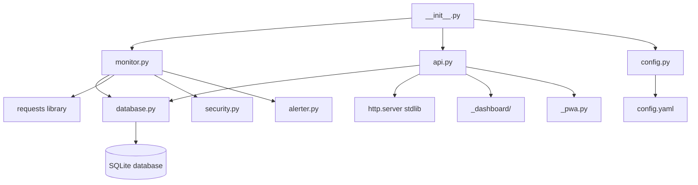
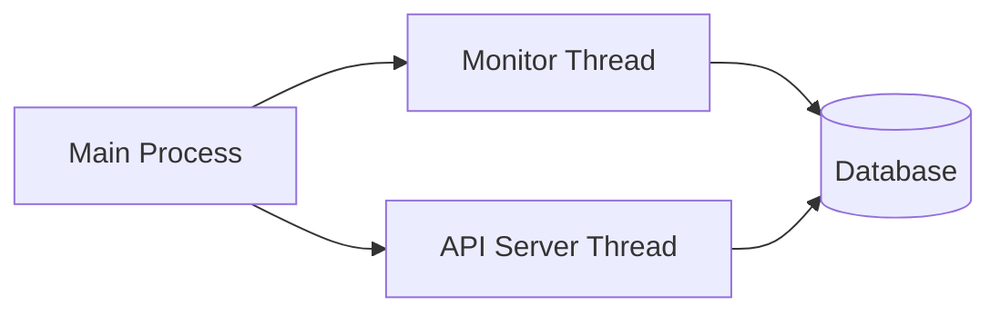
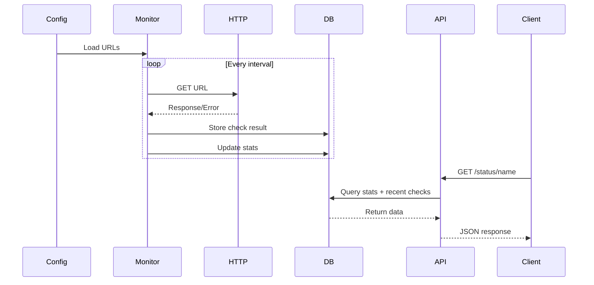

# Architecture Documentation - WebStatusπ

This document describes the system architecture, design decisions, and data flow for WebStatusπ. For hardware specifications, see [HARDWARE.md](HARDWARE.md).

## System Overview

WebStatusπ is a lightweight web monitoring system designed specifically for Raspberry Pi 1B+. It monitors configured URLs, tracks success/failure statistics, and provides a JSON API for accessing monitoring data.

**Hardware Target**: Raspberry Pi 1B+ (512MB RAM, single-core 700MHz ARM11)

### Component Diagram



## Core Components

1. **Monitor** (`monitor.py`): Main polling loop that checks URLs, TCP ports, and DNS at configured intervals
2. **Database** (`database.py`): SQLite operations (schema initialization, queries, statistics computed on-the-fly with CTEs)
3. **Web Server** (`api.py`): Minimal HTTP server using stdlib for serving JSON API, HTML dashboard, and PWA assets
4. **Config Loader** (`config.py`): YAML parsing and validation with dataclasses, supports environment variable overrides
5. **Entry Point** (`__init__.py`): CLI entry point that orchestrates monitor and API server threads
6. **Security** (`security.py`): SSRF protection, URL validation, and input sanitization
7. **Alerter** (`alerter.py`): Webhook-based alert system for URL status changes
8. **Dashboard** (`_dashboard/`): Embedded HTML/CSS/JS for the web dashboard with CSP nonce support
9. **PWA** (`_pwa.py`): Progressive Web App assets (manifest, service worker, icons)

## Performance Constraints (Pi 1B+ Specific)

The Raspberry Pi 1B+ has severe resource limitations that drive all architectural decisions:

- **CPU**: Single-core 700MHz ARM11 processor
- **RAM**: 512MB (shared with GPU ~256MB available for OS)
- **Network**: 10/100 Ethernet only
- **Storage**: SD card (slow I/O, wear considerations)

**Constraints**:
- Must be extremely lightweight
- Avoid heavy frameworks (no Flask, FastAPI, Django)
- Use stdlib wherever possible
- Minimize dependencies
- Avoid CPU-intensive operations
- Minimize disk writes (SD card wear)

## Thread Architecture

The system uses two main threads: one for monitoring URLs and one for serving the API.



### Thread Responsibilities

**Monitor Thread**:
- Polls URLs, TCP ports, and DNS records at configured intervals
- Performs content validation (keyword, JSON path) and SSL certificate checks
- Stores check results in database
- Triggers webhook alerts on status changes
- Detects internet connectivity issues
- Logs results to console

**API Server Thread**:
- Listens for HTTP requests on configured port
- Queries database for statistics
- Returns JSON responses
- Handles errors gracefully

Both threads share the same SQLite database. SQLite handles concurrent access internally (readers don't block readers, writes are serialized).

## Data Flow

### Monitoring Flow



### Detailed Monitoring Flow

1. **Configuration Loading** (`__init__.py` → `config.py`):
   - Load and validate `config.yaml`
   - Apply environment variable overrides (e.g., `WEBSTATUS_API_PORT`)
   - Parse server settings, monitoring settings, and URL/TCP/DNS targets
   - Validate intervals, timeouts, and URL names
   - Validate URLs for SSRF protection (`security.py`)

2. **Database Initialization** (`__init__.py` → `database.py`):
   - Create SQLite database file if not exists (default: `~/.local/share/webstatuspi/status.db`)
   - Create single `checks` table with all check data
   - Create indexes for efficient queries (`url_name`, `checked_at`, composite index)
   - Auto-migrate schema for new columns (SSL fields, HTTP headers)

3. **Monitoring Loop** (`monitor.py`):
   - For each configured target (URL, TCP, DNS):
     - Wait for configured interval
     - Execute appropriate check (HTTP GET, TCP connect, DNS resolve)
     - For HTTPS URLs: Extract SSL certificate information
     - For URLs with validation: Check keyword or JSON path in response body
     - Record response time, status code, success/failure, HTTP headers
     - Store result in `checks` table
     - Trigger webhook alerts on status changes (`alerter.py`)
     - Log result to console
   - Periodically check internet connectivity via Google DNS

4. **API Requests** (`api.py`):
   - Accept HTTP GET/DELETE requests
   - Apply rate limiting (60 req/min per IP, except localhost/private)
   - Parse URL path (`/`, `/status`, `/status/{name}`, `/history/{name}`, `/metrics`, `/reset`)
   - Query `checks` table and compute statistics on-the-fly with CTEs (no separate stats table)
   - Statistics include: uptime, avg/min/max/p50/p95/p99 response times, std deviation, consecutive failures
   - Format JSON response with security headers (CSP, X-Frame-Options, etc.)
   - Return HTTP response with JSON body or Prometheus metrics

## Database Design

### Schema

The database uses a single denormalized table for simplicity and performance. Statistics are computed on-the-fly using SQL CTEs (Common Table Expressions) rather than stored in a separate table.

```sql
CREATE TABLE checks (
    id INTEGER PRIMARY KEY AUTOINCREMENT,
    url_name TEXT NOT NULL,           -- Identifier (e.g., "MY_SITE")
    url TEXT NOT NULL,                -- Full URL (e.g., "https://example.com")
    status_code INTEGER,              -- HTTP status code (null for TCP/DNS checks)
    response_time_ms INTEGER NOT NULL, -- Response time in milliseconds
    is_up INTEGER NOT NULL,           -- 1 = up, 0 = down
    error_message TEXT,               -- Error details when is_up = 0
    checked_at TEXT NOT NULL,         -- ISO 8601 timestamp

    -- HTTP response metadata
    content_length INTEGER,           -- Content-Length header value
    server_header TEXT,               -- Server header value
    status_text TEXT,                 -- HTTP status text (e.g., "OK")

    -- SSL certificate information (HTTPS only)
    ssl_cert_issuer TEXT,             -- Certificate issuer (e.g., "Let's Encrypt")
    ssl_cert_subject TEXT,            -- Certificate subject (common name)
    ssl_cert_expires_at TEXT,         -- Expiration date (ISO 8601)
    ssl_cert_expires_in_days INTEGER, -- Days until expiration (negative if expired)
    ssl_cert_error TEXT               -- SSL extraction error message
);

-- Indexes for efficient queries
CREATE INDEX idx_checks_url_name ON checks(url_name);
CREATE INDEX idx_checks_checked_at ON checks(checked_at);
CREATE INDEX idx_checks_url_name_checked_at ON checks(url_name, checked_at);
```

### Design Rationale

- **Single table design**: Simpler schema, no foreign key constraints, easier maintenance
- **Denormalized URL data**: `url_name` and `url` stored per check for self-contained records
- **On-the-fly statistics**: CTEs compute percentiles, averages, and trends without a separate stats table
- **SSL monitoring built-in**: Certificate info stored with each check for historical tracking
- **Indexes optimized for common queries**:
  - `url_name`: Fast lookups by identifier
  - `checked_at`: Time-based queries for retention cleanup
  - `(url_name, checked_at)`: Efficient 24-hour statistics queries

### Data Retention

The `checks` table can grow indefinitely without retention limits. To prevent database size issues on the Raspberry Pi 1B+ SD card, automatic cleanup removes records older than a configured number of days.

**Default Retention: 7 days** (configurable via `database.retention_days` in `config.yaml`)

**Rationale for 7-day default:**
- **Storage calculation**: With typical usage (5-10 URLs, 30-60s intervals):
  - ~14,400 checks/day × ~200 bytes/check ≈ **2.9 MB/day** (with SSL fields)
  - 7 days ≈ **20 MB** total (manageable for SD card)
  - 30 days ≈ **87 MB** (larger but acceptable if needed)
- **Benefits**:
  - Balances useful history (weekly patterns) with storage constraints
  - Reduces SD card wear (fewer long-running queries)
  - Keeps database size manageable for Pi 1B+ hardware
  - Maintains query performance (smaller table = faster queries)
- **Implementation**: Periodic cleanup runs after each check cycle

**Database location**: Default XDG path `~/.local/share/webstatuspi/status.db`, configurable via `database.path` in config.

## API Design

### Endpoints

| Method | Endpoint | Description |
|--------|----------|-------------|
| `GET` | `/` | HTML dashboard with real-time status |
| `GET` | `/status` | JSON status for all monitored targets |
| `GET` | `/status/{name}` | JSON status for a specific target |
| `GET` | `/history/{name}` | Check history for last 24 hours (max 100 records) |
| `GET` | `/health` | Health check endpoint |
| `GET` | `/metrics` | Prometheus-format metrics |
| `DELETE` | `/reset` | Delete all check data (requires token if configured) |

#### `GET /status`

Returns status and 24-hour statistics for all monitored targets.

**Response format**:
```json
{
  "urls": [
    {
      "name": "MY_SITE",
      "url": "https://example.com",
      "is_up": true,
      "status_code": 200,
      "response_time_ms": 150,
      "error": null,
      "last_check": "2026-01-23T10:30:00Z",
      "checks_24h": 1440,
      "uptime_24h": 99.5,
      "avg_response_time_24h": 145.2,
      "min_response_time_24h": 120,
      "max_response_time_24h": 200,
      "p50_response_time_24h": 142,
      "p95_response_time_24h": 185,
      "p99_response_time_24h": 198,
      "stddev_response_time_24h": 15.3,
      "consecutive_failures": 0,
      "last_downtime": null,
      "content_length": 12345,
      "server_header": "nginx",
      "status_text": "OK",
      "ssl_cert_issuer": "Let's Encrypt",
      "ssl_cert_subject": "example.com",
      "ssl_cert_expires_at": "2026-12-31T23:59:59Z",
      "ssl_cert_expires_in_days": 365,
      "ssl_cert_error": null
    }
  ],
  "summary": {
    "total": 1,
    "up": 1,
    "down": 0
  },
  "internet_status": true
}
```

#### `GET /status/{name}`

Returns detailed status for a specific target by name. Same response format as individual entry in `/status`.

#### `GET /history/{name}`

Returns check history for a specific target (last 24 hours, max 100 records).

**Response format**:
```json
{
  "name": "MY_SITE",
  "checks": [
    {
      "checked_at": "2026-01-23T10:30:00Z",
      "is_up": true,
      "status_code": 200,
      "response_time_ms": 150,
      "error": null
    }
  ],
  "count": 100
}
```

#### `DELETE /reset`

Deletes all check records from the database. Protected endpoint:
- **Blocked through Cloudflare**: Returns 403 if request has Cloudflare headers
- **Token authentication**: If `api.reset_token` is configured, requires `Authorization: Bearer <token>` header

**Response format**:
```json
{
  "success": true,
  "deleted": 14400
}
```

**Notes**:
- Returns 404 if URL name not found
- All timestamps in ISO 8601 format with UTC timezone suffix (`Z`)
- Rate limited: 60 requests/minute per IP (local/private IPs exempt)

### Implementation Details

- Uses Python `http.server` (stdlib) - no external dependencies
- Thread-safe request handling with global database lock
- JSON responses using `json` module (stdlib)
- Security headers on all responses (CSP, X-Frame-Options, X-Content-Type-Options)
- CSP nonce for inline scripts in dashboard
- Error handling: Returns 404 for unknown URLs, 429 for rate limit, 500 for server errors

## Configuration Format

See [AGENTS.md](../AGENTS.md#configuration-format-configyaml) for detailed configuration documentation.

Key configuration sections:
- `server`: Port and host binding
- `monitoring`: Default intervals, timeouts, user agent
- `urls`: List of URLs to monitor with optional per-URL intervals

## Design Decisions

### Why stdlib `http.server` instead of Flask/FastAPI?

- **Zero dependencies**: No installation overhead
- **Lightweight**: Minimal memory footprint
- **Sufficient**: API is simple (GET requests, JSON responses)
- **Pi 1B+ constraint**: Every MB of RAM counts

### Why SQLite instead of PostgreSQL/MySQL?

- **Zero setup**: File-based, no server process
- **Lightweight**: Minimal memory footprint
- **Sufficient**: Single-process application, low write volume
- **Built-in**: Python stdlib includes sqlite3 module

### Why separate `stats` table instead of aggregating on-the-fly?

- **Performance**: Aggregating thousands of checks on every API request is expensive
- **Scalability**: As `checks` table grows, aggregation becomes slower
- **Simplicity**: Pre-computed stats make API queries trivial
- **Trade-off**: Small storage overhead for much better query performance

### Why threading instead of async/await?

- **Simplicity**: Threading is straightforward and well-understood
- **Compatibility**: Python 3.11+ required, threading is mature
- **Sufficient**: Two threads (monitor + API) is manageable
- **SQLite**: Works well with threading (multiple readers, serialized writers)

## Performance Considerations

### Expected Performance (Pi 1B+ with Raspberry Pi OS Lite)

Based on [Hardware Load Analysis](HARDWARE-LOAD-ANALYSIS.md):

| Scenario | URLs | CPU Est. | RAM Est. | RAM % | Status |
|----------|------|----------|----------|-------|--------|
| Current | 2 | 13-32% | 103-189MB | 21-38% | ✅ OK |
| Moderate | 5 | 14-36% | 106-194MB | 21-39% | ✅ OK |
| **Target** | 10 | 15-44% | 108-199MB | 22-40% | ✅ OK |

Other metrics:
- **Startup time**: < 5 seconds
- **API response time**: < 100ms for stats endpoint
- **Check overhead**: < 50ms per URL (excluding network time)
- **Display overhead**: ~2-4% CPU, ~7-14MB RAM
- **Available RAM**: ~448-496MB (with `gpu_mem=16`)

**Note**: Raspberry Pi OS Lite provides ~448-496MB available RAM (vs ~256MB with desktop). This provides comfortable headroom for 10 URLs with OLED display.

### Identified Risks

1. **Memory Leaks** (Medium Risk): Monitor RAM usage in production, ensure proper resource cleanup
2. **SD Card Wear** (Medium-Low Risk): WAL mode and 7-day retention mitigate this
3. **CPU Spikes on Timeouts** (Low Risk): Stagger intervals to avoid bursts

### Optimization Strategies

1. **Minimize database writes**: Batch updates when possible
2. **Use indexes**: All foreign keys and frequently queried columns are indexed
3. **Separate stats table**: Avoid aggregations on large `checks` table
4. **Efficient queries**: Query only needed columns, use LIMIT for recent checks
5. **Minimal logging**: Reduce SD card writes (only log errors, not every check)
6. **Display optimization**: Update only when data changes, use 1-2 FPS refresh rate

### Scalability Limits

Designed for:
- **Up to 10 URLs** with Raspberry Pi OS Lite (with OLED display)
- **Intervals ≥ 30 seconds** (60s recommended) to prevent CPU overload
- **Timeout ≤ 10 seconds** to avoid blocking
- **Long-running**: Days/weeks without memory leaks

Not designed for:
- Hundreds of URLs (insufficient RAM/CPU)
- Sub-second intervals (CPU overload)
- High API traffic (single-threaded server)

## Progressive Web App (PWA) Architecture

The dashboard is a Progressive Web App, enabling offline access and app-like installation.

### PWA Components

```
Client Browser
├── manifest.json          # App metadata (name, icons, theme)
├── sw.js                  # Service Worker (caching logic)
├── icon-192.png          # App icon (192x192)
├── icon-512.png          # App icon (512x512)
└── / (dashboard)          # Main HTML with PWA meta tags
```

### Caching Strategy

The Service Worker implements a hybrid caching strategy:

| Resource Type | Strategy | Rationale |
|---------------|----------|-----------|
| Static assets (`/`, `/manifest.json`, icons) | Cache-first | Fast loading, versioned via SW_VERSION |
| API endpoints (`/status`, `/history`) | Network-first | Fresh data preferred, cache fallback for offline |
| Destructive endpoints (`/reset`) | Network-only | Never cached |

### Cache Versioning

```javascript
const SW_VERSION = '1.0.0';  // Update when dashboard changes
const CACHE_NAME = `webstatuspi-v${SW_VERSION}`;
```

When `SW_VERSION` changes:
1. Browser detects new Service Worker
2. New SW installs and caches assets
3. On activation, old caches are deleted
4. User sees updated dashboard

### Offline Support

- **Dashboard**: Served from cache when offline
- **API data**: Last cached response shown
- **Offline banner**: Visual indicator when network unavailable
- **Auto-refresh**: Fetches fresh data when connection restored

### Server-Side Implementation

All PWA assets are embedded as Python string constants in `_pwa.py`:
- Zero external file dependencies
- Consistent with dashboard HTML embedding pattern
- No additional server configuration required

### HTTPS Requirement

- **Development**: Works on `localhost` without HTTPS
- **Production**: HTTPS required for Service Worker and install prompt
- Recommend: Nginx reverse proxy with Let's Encrypt

## Future Architecture Considerations

### Phase 2: Hardware Integration

- Add GPIO initialization and management
- Implement OLED display driver
- Add button interrupt handling
- Integrate buzzer and LED control

See [HARDWARE.md](HARDWARE.md) for detailed hardware specifications.

### Potential Enhancements (Not Implemented Yet)

- **Push notifications**: Browser push notifications via Service Worker (PWA infrastructure ready)
- **Ping/ICMP checks**: Raw ICMP ping (requires root privileges)
- **Email alerts**: SMTP-based notifications (currently only webhooks supported)

### Implemented Features

The following features are fully implemented:

- **TCP port checks**: Monitor non-HTTP services (databases, caches, custom services)
- **DNS resolution checks**: Monitor DNS resolution with optional expected IP validation
- **Response validation**: Keyword matching and JSON path validation in response body
- **SSL certificate monitoring**: Automatic certificate expiration tracking for HTTPS URLs
- **Webhook alerts**: Slack, Discord, Telegram (via relay), PagerDuty, custom HTTP endpoints
- **Prometheus metrics**: Full metrics export for Grafana integration

## Security Features

### SSRF Protection

URLs configured for monitoring are validated to prevent Server-Side Request Forgery:

- **Blocked schemes**: Only `http://` and `https://` allowed
- **Blocked ports**: Internal service ports (22, 3306, 5432, 6379, etc.)
- **Blocked IPs**: Private ranges (10.x, 172.16.x, 192.168.x), localhost, link-local
- **DNS rebinding protection**: Hostname resolved and validated before requests

Location: `security.py:46-115`

### Rate Limiting

API endpoints are protected against DoS attacks:

- **Limit**: 60 requests per minute per IP
- **Exempt**: Localhost and private IP addresses
- **Response**: HTTP 429 when limit exceeded
- **Implementation**: Sliding window algorithm with automatic cleanup

Location: `api.py:49-101`

### Content Security Policy

The dashboard uses strict CSP with nonces:

- **Nonce-based scripts**: Unique nonce per request for inline scripts
- **External resources**: Only Google Fonts allowed
- **Frame protection**: `frame-ancestors 'none'` prevents clickjacking
- **Additional headers**: X-Frame-Options, X-Content-Type-Options, X-XSS-Protection

### Reset Endpoint Protection

The `DELETE /reset` endpoint has additional safeguards:

- **Cloudflare detection**: Blocked if request has CF-* headers (external access)
- **Token authentication**: Optional Bearer token requirement via `api.reset_token` config
- **Timing-safe comparison**: Uses `secrets.compare_digest()` to prevent timing attacks

## Error Handling Strategy

### Network Errors

- **Timeouts**: Treat as failure, log as "Connection timeout"
- **DNS failures**: Treat as failure, log as "DNS resolution failed"
- **Connection refused**: Treat as failure, log as "Connection refused"
- **SSL errors**: Treat as failure, log specific SSL error

### Application Errors

- **Configuration errors**: Fail fast on startup (don't run with invalid config)
- **Database errors**: Log error, attempt to continue (monitoring more important than stats)
- **API errors**: Log error, return 500 status, keep monitoring running

### Graceful Degradation

- If database fails, continue monitoring but log to console only
- If API server fails to start, continue monitoring (primary function)
- If config reload fails, keep using previous valid configuration

## Related Documentation

- [AGENTS.md](../AGENTS.md) - Development rules and conventions
- [HARDWARE.md](HARDWARE.md) - Hardware specifications and GPIO pin assignments
- [testing/](testing/) - Testing strategies and mocking guidelines
- [README.md](../README.md) - User guide and quick start
