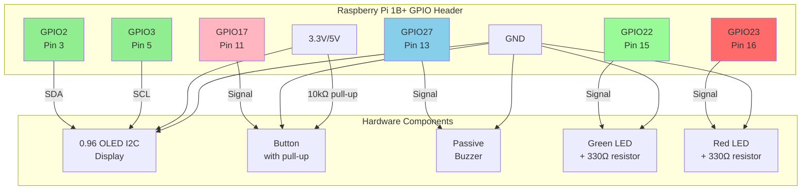
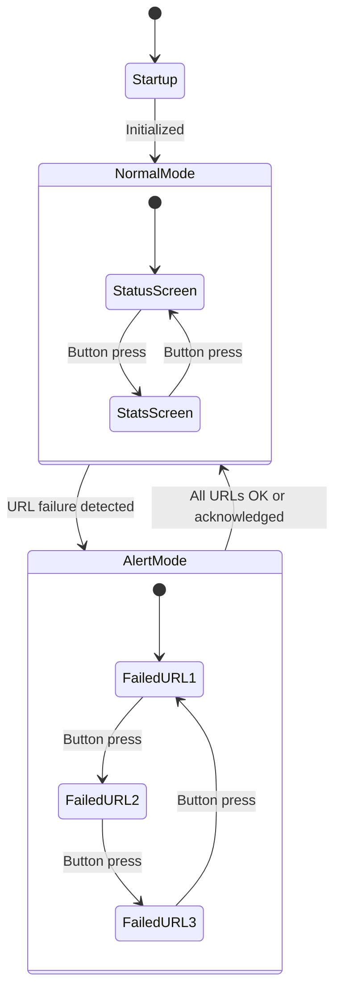

# Hardware Specifications - WebStatusPi

This document describes the hardware components, GPIO pin assignments, and display UI specifications for WebStatusPi. These features are planned for Phase 2 and should NOT be implemented until requested.

## Target Environment

- **OS**: Raspberry Pi OS Lite (headless, no desktop)
- **GPU Memory**: `gpu_mem=16` in `/boot/config.txt`
- **Available RAM**: ~496MB (sufficient for all features including OLED display)

See [Hardware Load Analysis](HARDWARE-LOAD-ANALYSIS.md) for detailed resource calculations.

## Hardware Components

1. **0.96" OLED Display (I2C)** - See [Display UI Specifications](#display-ui-specifications)
2. **Physical Button (GPIO)** - For screen navigation
3. **Buzzer (GPIO)** - Audio alerts on failures
4. **Status LEDs (GPIO)** - Visual status indicators

## Hardware Specifications

### OLED Display

- **Display**: 0.96" OLED I2C (128x64 pixels, monochrome)
- **Resolution**: 128 pixels wide × 64 pixels tall
- **Font recommendations**:
  - **Large text** (URLs/Status): 12-16px (3-4 lines max)
  - **Small text** (Stats/Details): 8-10px (6-8 lines max)
  - **Monospace font** for alignment (Courier, DejaVu Sans Mono)

### GPIO Pin Assignment

```yaml
hardware:
  button_pin: 17      # GPIO17 (physical pin 11)
  buzzer_pin: 27      # GPIO27 (physical pin 13)
  led_green_pin: 22   # GPIO22 (physical pin 15)
  led_red_pin: 23     # GPIO23 (physical pin 16)
  oled_sda: 2         # GPIO2 (I2C SDA, physical pin 3)
  oled_scl: 3         # GPIO3 (I2C SCL, physical pin 5)
```

### Connection Diagram



### Physical Pinout Reference

```
     ┌─────────────────────────────────────────┐
     │  3.3V  [ 1] [ 2]  5V                   │
     │  GPIO2 [ 3] [ 4]  5V      ← I2C SDA    │
     │  GPIO3 [ 5] [ 6]  GND     ← I2C SCL    │
     │  GPIO4 [ 7] [ 8]  GPIO14               │
     │    GND [ 9] [10]  GPIO15               │
     │ GPIO17 [11] [12]  GPIO18  ← Button     │
     │ GPIO27 [13] [14]  GND     ← Buzzer     │
     │ GPIO22 [15] [16]  GPIO23  ← LEDs       │
     │  3.3V  [17] [18]  GPIO24               │
     │      ... (remaining pins) ...          │
     └─────────────────────────────────────────┘
```

### Connection Details

**OLED Display (I2C)**:
- `VCC` → 3.3V or 5V (check OLED module specs)
- `GND` → GND (any ground pin)
- `SDA` → GPIO2 (physical pin 3)
- `SCL` → GPIO3 (physical pin 5)

**Button**:
- One terminal → GPIO17 (physical pin 11)
- Other terminal → GND
- **Note**: Requires external 10kΩ pull-up resistor between GPIO17 and 3.3V, or enable internal pull-up in software

**Buzzer (Passive)**:
- Positive terminal → GPIO27 (physical pin 13)
- Negative terminal → GND
- **Note**: Use a passive buzzer for PWM control. Active buzzers may work but offer less control.

**Green LED**:
- Anode → 330Ω resistor → GPIO22 (physical pin 15)
- Cathode → GND

**Red LED**:
- Anode → 330Ω resistor → GPIO23 (physical pin 16)
- Cathode → GND

**Important Notes**:
- All GND connections can share the same ground rail
- GPIO pins output 3.3V logic (not 5V tolerant)
- Use appropriate resistors to protect GPIO pins and components
- I2C bus (GPIO2/GPIO3) is shared; ensure no conflicts with other I2C devices

## Display UI Specifications

The display has two main modes: **Alert Mode** (when failures detected) and **Normal Mode** (all URLs healthy).

### Display State Machine



### Alert Mode (One or More URLs Failing)

**Trigger**: Automatically activates when any URL transitions from OK → FAIL

**Button behavior**: Advances to next failed URL (cycles through failed URLs only)

**Screens** (cycle through failed URLs):

```
┌────────────────────┐
│ ⚠ ALERT            │  ← Header (inverted colors)
│                    │
│ APP_ES             │  ← URL name (large, bold)
│ ✗ 503              │  ← Status icon + code
│ 123ms              │  ← Response time
│                    │
│ [1/3]              │  ← Indicator (screen 1 of 3 failing)
└────────────────────┘

Press button → Next failed URL

┌────────────────────┐
│ ⚠ ALERT            │
│                    │
│ API_PROD           │
│ ✗ Timeout          │  ← Error message if no status code
│ 10000ms            │
│                    │
│ [2/3]              │
└────────────────────┘
```

**After viewing all failed URLs**: Button press exits Alert Mode → enters Normal Mode

### Normal Mode (All URLs Healthy or After Acknowledging Alerts)

**Trigger**: All URLs are OK, or user has acknowledged all alerts

**Button behavior**: Cycles between two screen types for all URLs

**Screen Type 1: Current Status** (auto-rotates every 5 seconds between URLs)

```
┌────────────────────┐
│ STATUS    [1/5]    │  ← Header + URL counter
│                    │
│ APP_ES             │  ← URL name (large)
│ ✓ 200              │  ← Status icon + code
│ 234ms              │  ← Response time
│                    │
│ Last: 22:30:15     │  ← Timestamp of last check
└────────────────────┘
```

**Screen Type 2: Statistics** (auto-rotates every 5 seconds between URLs)

```
┌────────────────────┐
│ STATS     [1/5]    │  ← Header + URL counter
│                    │
│ APP_ES             │  ← URL name (large)
│                    │
│ 2/150   98.7%      │  ← Failures/Total + Success rate
│                    │
│ Uptime: 24h        │  ← Optional: time since last failure
└────────────────────┘
```

**Button press**: Cycles between screen types (Status → Stats → Status...)
**Auto-rotation**: Within each screen type, URLs rotate every 5 seconds

### Summary/Overview Screen (Optional Enhancement)

When button is held for 2+ seconds in Normal Mode, show overview:

```
┌────────────────────┐
│ OVERVIEW           │
│                    │
│ APP_ES    ✓ 98.7%  │  ← Name + icon + success rate
│ API_PROD  ✓ 99.1%  │
│ GOOGLE    ✓ 100%   │
│ GITHUB    ✗ 95.3%  │  ← Failed URL (red icon)
│                    │
│ 4 URLs  • 1 Alert  │  ← Summary footer
└────────────────────┘
```

## LED Behavior

**Green LED**:
- **Solid ON**: All URLs healthy (success rate 100%)
- **OFF**: One or more URLs failing

**Red LED**:
- **OFF**: All URLs healthy
- **Blinking (1Hz)**: One or more URLs failing
- **Solid ON**: Critical failure (all URLs down)

## Buzzer Behavior

**Trigger**: Only when a URL transitions from OK → FAIL (not on every failed check)

**Pattern**: Intermittent beeping (0.5s ON, 0.5s OFF) for 30 seconds

**Stop conditions**:
- User presses button (immediate silence + acknowledge alert)
- 30 seconds elapsed (auto-silence, alert remains on display)

**Note**: Buzzer does NOT re-trigger if URL stays failing. Only triggers on state change OK → FAIL.

## Display Update Frequency

- **Check results**: Update immediately when check completes
- **Stats**: Update after each check
- **Auto-rotation**: Every 5 seconds (configurable)
- **Screen refresh rate**: 1-2 FPS (sufficient for OLED, saves CPU)

## Configuration Options (config.yaml)

```yaml
display:
  enabled: true
  rotation_interval: 5  # seconds between auto-rotation
  brightness: 255  # 0-255 (OLED brightness)

buzzer:
  enabled: true
  duration: 30  # seconds before auto-silence

leds:
  enabled: true
```

## Text Layout Guidelines

**Maximum characters per line** (based on font size):
- **16px font**: ~8-10 characters (URLs, status codes)
- **12px font**: ~10-12 characters
- **8px font**: ~16-20 characters (stats, timestamps)

**Layout priorities** (limited space):
1. URL name (most important, large and bold)
2. Status indicator (✓/✗) + status code/error
3. Response time or success rate
4. Timestamp or secondary info

**Text truncation**: If URL name exceeds 10 characters (shouldn't happen with validation), truncate with "...":
- "VERYLONGNAME" → "VERYLONG..."

## Error Handling (Hardware)

- **I2C communication failure**: Log error, continue monitoring (display non-critical)
- **Display initialization failure**: Log warning, disable display, continue monitoring
- **Button debouncing**: 200ms debounce to prevent multiple triggers
- **GPIO pin conflicts**: Validate pin assignments at startup, fail fast if conflicts detected

## Performance Considerations (Pi 1B+ with Lite)

With Raspberry Pi OS Lite and `gpu_mem=16`, ~496MB RAM is available. Display adds ~7-14MB which is well within limits.

- **Display updates**: Only redraw when data changes (avoid constant screen refresh)
- **CPU usage**: Display thread should use <5% CPU
- **I2C frequency**: Use standard 100kHz (not fast mode 400kHz) for reliability
- **Font rendering**: Pre-render common characters to reduce CPU load
- **Button polling**: Use interrupts instead of polling for button events (saves CPU)

## Dependencies (Phase 2)

When adding hardware features:

```
Adafruit-SSD1306==1.6.2  # OLED display support (I2C)
RPi.GPIO==0.7.1          # GPIO control (button, buzzer, LEDs)
Pillow==9.5.0            # Image generation for OLED
```

See also [Testing Documentation](testing/MOCKING.md) for information on mocking hardware components during development.

## Learning Resources and Examples

This section provides essential tutorials and examples for beginners to understand the concepts mentioned in the connection diagram above.

### Pull-up Resistors

The button connection requires a pull-up resistor (10kΩ between GPIO17 and 3.3V). This ensures the GPIO pin has a defined voltage when the button is not pressed.

**Essential resources**:
- [Raspberry Pi Using Pull-Up and Pull-Down Resistors](https://grantwinney.com/raspberry-pi-using-pullup-and-pulldown-resistors/) - Tutorial with examples and Python code
- [GPIO Internal Pull-Up/Pull-Down (Software Alternative)](https://gpiozero.readthedocs.io/en/stable/recipes.html#button) - Use software pull-up to eliminate external resistor

### I2C Protocol and OLED Display

The OLED display uses I2C (Inter-Integrated Circuit) protocol for communication. I2C requires two wires: SDA (data) and SCL (clock).

**Essential resources**:
- [Understanding I2C Protocol (SparkFun Tutorial)](https://learn.sparkfun.com/tutorials/i2c/all) - Learn how I2C works
- [SSD1306 OLED Displays with Raspberry Pi (Adafruit Tutorial)](https://learn.adafruit.com/ssd1306-oled-displays-with-raspberry-pi-and-beaglebone-black/usage) - Complete guide with wiring and Python code

### GPIO Basics

GPIO (General Purpose Input/Output) pins allow the Raspberry Pi to interact with external components.

**Essential resources**:
- [Raspberry Pi GPIO Pinout Guide](https://pinout.xyz/) - Interactive GPIO pin reference
- [GPIO Zero Library Documentation](https://gpiozero.readthedocs.io/) - Beginner-friendly GPIO library with examples

### LEDs with Current-Limiting Resistors

LEDs require a current-limiting resistor (330Ω in this project) to prevent damage to both the LED and GPIO pin.

**Essential resources**:
- [LED Resistor Calculator](https://www.digikey.com/en/resources/conversion-calculators/conversion-calculator-led-series-resistor) - Calculate resistor value for LEDs
- [Why LEDs Need Resistors (Electronics Tutorial)](https://www.electronics-tutorials.ws/diode/led-circuit.html) - Understand LED circuits

### Passive Buzzers and PWM

This project uses a passive buzzer, which requires PWM (Pulse Width Modulation) signals to generate different tones.

**Essential resources**:
- [Passive vs Active Buzzer Explained](https://www.instructables.com/How-to-Use-a-Buzzer-Arduino-Tutorial/) - Understand the difference
- [Raspberry Pi PWM Tutorial](https://www.raspberrypi-spy.co.uk/2012/07/software-based-pwm-on-raspberry-pi/) - Learn how PWM works

### Breadboard Basics

When prototyping, you'll likely use a breadboard to connect components.

**Essential resource**:
- [How Breadboards Work (SparkFun Tutorial)](https://learn.sparkfun.com/tutorials/how-to-use-a-breadboard/all) - Complete breadboard guide

### General Resources

**Official documentation and comprehensive guides**:
- [Raspberry Pi Official GPIO Guide](https://www.raspberrypi.org/documentation/usage/gpio/) - Official documentation
- [Adafruit Learning System - Raspberry Pi](https://learn.adafruit.com/category/raspberry-pi) - Step-by-step projects and tutorials

**Essential concepts to remember**:
- **Ground (GND)**: Common reference point (0V) that all components share
- **3.3V vs 5V**: GPIO pins output 3.3V logic; using 5V can damage them
- **Current limiting**: Always use resistors to limit current through LEDs and other components
- **Short circuits**: Never connect VCC directly to GND without a load (this causes damage)

**Safety tips**:
- Always double-check connections before powering on
- Use appropriate resistor values to protect components
- Don't exceed GPIO pin current limits (~16mA per pin, ~50mA total)
- Disconnect power before making wiring changes
